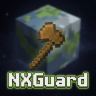

# NXGuard

**NXGuard** es un plugin para servidores Minecraft que te permite gestionar las flags de tus regiones de WorldGuard de forma visual, sin necesidad de escribir comandos. Todo se hace desde un menú de inventario.

---

## ¿Para qué sirve?

Si usas WorldGuard en tu servidor para proteger zonas (spawn, tiendas, arenas PvP, etc.), NXGuard te da una interfaz gráfica para activar o desactivar las flags de cada región con un solo click, en lugar de tener que escribir `/rg flag <región> <flag> <valor>` cada vez.

---

## ¿Qué puedes hacer con NXGuard?

- Ver todas las regiones de tu mundo en un menú paginado.
- Abrir el editor de flags de cualquier región con un click.
- Ver el estado de cada flag de un vistazo gracias a los colores:
  - **Verde lima** → flag activada (ALLOW)
  - **Rojo** → flag desactivada (DENY)
  - **Gris** → sin valor asignado (NONE - usa el comportamiento por defecto de WorldGuard)
- Activar, desactivar o resetear flags con click izquierdo y derecho.
- Consultar la información completa de una región por chat.
- Personalizar títulos, colores y mensajes desde el `config.yml`.

---

## Requisitos

| Requisito | Notas |
|---|---|
| Minecraft Paper / Spigot | Versión 1.20 o superior |
| WorldGuard | Obligatorio |
| WorldGuard Extra Flags | Opcional — sus flags aparecen automáticamente |

---

## Contenido de esta guía

- [Instalación](instalacion.md)
- [Comandos](comandos.md)
- [Permisos](permisos.md)
- [Configuración](configuracion/config-yml.md)
- [Uso del GUI](gui.md)
- [Sistema de flags](flags.md)
- [Preguntas frecuentes](faq.md)
